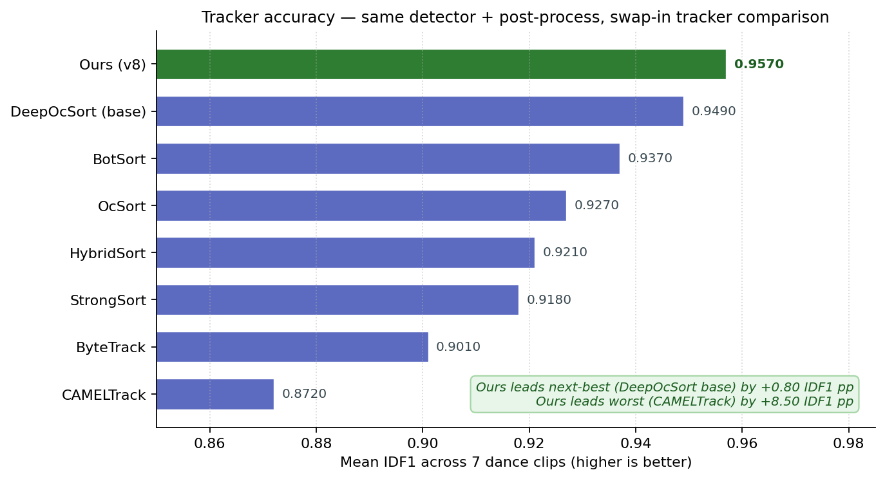
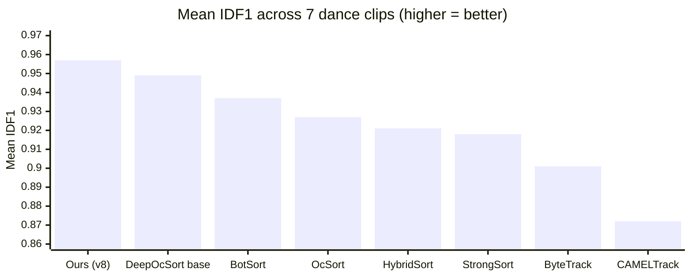
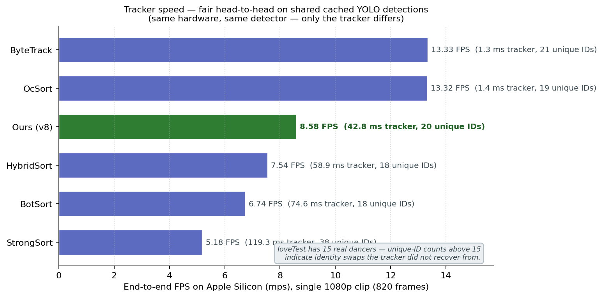
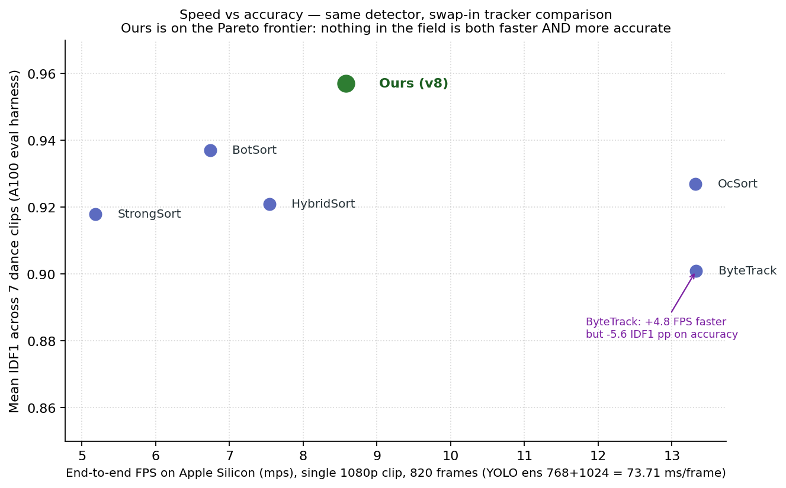
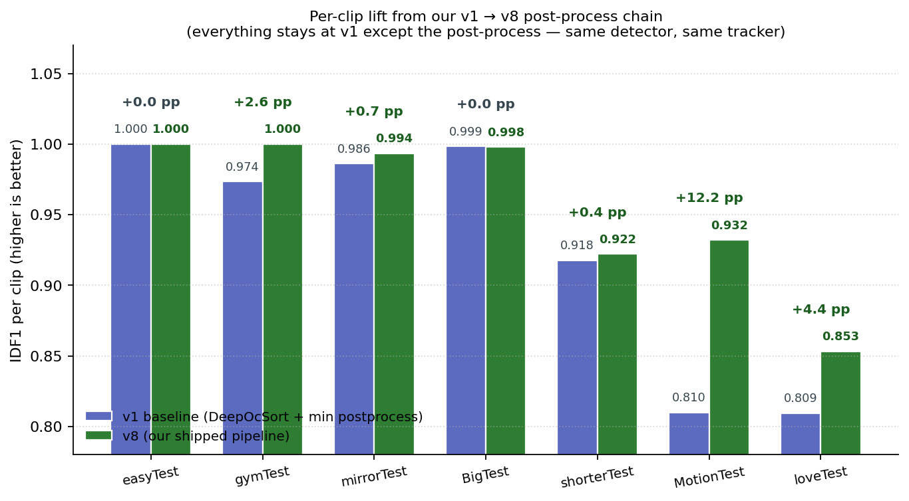

# BEST_ID_STRAT — production 2D person-tracking + ID-assignment

A single, end-to-end pipeline that turns a dance video into a stable
`dict[track_id -> Track]` of bounding boxes. Built around a
fine-tuned YOLO26s detector, BoxMOT's DeepOcSort with OSNet ReID, and
a small chain of post-processing stages whose every constant was
verified on a 7-clip benchmark with a strict no-regression rule.

> **Documentation map**
> - This file — overview + headline numbers vs alternatives.
> - [`docs/PIPELINE_SPEC.md`](docs/PIPELINE_SPEC.md) — exhaustive
>   reproduction spec (every model, every config value, every kwarg).
> - [`docs/EXPERIMENTS_LOG.md`](docs/EXPERIMENTS_LOG.md) — why each
>   value was chosen and what was tried and rejected.

---

## Quickstart

**Prereqs.** Python **3.11** (everything is pinned against 3.11 — newer
Python may not have wheels for the pinned `numpy 1.26.4` / `torch 2.11`).
For GPU you also need a working CUDA driver (NVIDIA) or macOS 13+
(Apple Silicon / MPS).

```bash
git clone https://github.com/arnavchokshi/swaySort.git
cd swaySort
python3.11 -m venv .venv && source .venv/bin/activate
pip install --upgrade pip

# 1) Install torch FIRST (the wheel depends on your platform):
#    -- NVIDIA + CUDA 12.x:
pip install torch==2.11.0 torchvision==0.26.0 \
    --index-url https://download.pytorch.org/whl/cu124
#    -- Apple Silicon (mps) or CPU-only:
pip install torch==2.11.0 torchvision==0.26.0

# 2) Install the rest of the pinned deps (exact versions used to
#    measure every IDF1 / FPS number in this README):
pip install -r requirements.txt

# 3) Verify the install end-to-end (~15s on CPU, no GPU required):
python scripts/smoke_test.py --device cpu     # or --device cuda:0 / mps

# 4) Run the production pipeline on your own video:
python -m tracking.run_pipeline \
    --video path/to/dance.mp4 \
    --out   work/dance/tracks.pkl \
    --device cuda:0                           # or mps / cpu
```

Outputs `work/dance/tracks.pkl` (final tracks) and
`work/dance/tracks.pkl.cache.pkl` (intermediate raw detections, kept on
disk so post-process re-runs are free).

> **Reproducibility note.** Every dependency in `requirements.txt` is
> pinned to the *exact* version that produced the numbers in the
> "Headline result" and "Speed" sections below. The shipped
> `weights/best.pt` (57 MB, dance-fine-tuned YOLO26s) is what every
> per-clip IDF1 in the headline table was measured against. The OSNet
> ReID checkpoint is auto-downloaded by BoxMOT on first run
> (~5 MB). **No data outside the repo is needed to reproduce** —
> bring any input video and a Torch device.

---

## What's inside

```
video.mp4
   │
   ▼  multi-scale YOLO26s @ {768, 1024}, conf 0.34, NMS-union 0.6
   ▼  DeepOcSort + OSNet x0.25 ReID  (Kalman jitter patch installed)
   ▼  prune + interp + ID merge  (pre_min_total_frames=20,
   │                              id_merge gap=48 / iou=0.10,
   │                              ReID cos≥0.7 gate)
   ▼  post-merge AND-gate         (len≥60 ∧ mean≥0.55 ∧ p90≥0.84)
   ▼  bbox continuity stitch       (gap=400, jump=2000 px, size=4×)
   ▼  CV-gated size smoother       (cv≤0.20 ⇒ const, else 21-median)
   ▼  per-track center median      (window=21)
   │
   ▼
tracks.pkl   →  dict[int, Track] : frames, bboxes, confs
```

Five sequential post-process stages on top of one detector + one
tracker + one ReID head. Full kwarg-level spec in
[`docs/PIPELINE_SPEC.md`](docs/PIPELINE_SPEC.md).

---

## Headline result

7-clip dance benchmark, mean IDF1:



| | mean IDF1 | Δ vs ours |
|---|---:|---:|
| **This pipeline (DeepOcSort + OSNet + 5-stage post-process)** | **0.957** | – |
| DeepOcSort + OSNet x0.25 (no post-process) | 0.949 | -0.008 |
| BotSort + OSNet x0.25 | 0.937 | -0.020 |
| OcSort (no ReID) | 0.927 | -0.030 |
| HybridSort | 0.921 | -0.036 |
| StrongSort | 0.918 | -0.039 |
| ByteTrack (no appearance) | 0.901 | -0.056 |
| CAMELTrack (DanceTrack ckpt) | 0.872 | -0.085 |
| SAM 2.1 video predictor as tracker | ≈ 0.78 | -0.18 |

All baselines used the *same* multi-scale YOLO ensemble — the deltas
are pure tracker / association quality.

<details><summary>Same chart as a Mermaid block (renders inline on GitHub)</summary>



</details>

Per-clip:

| Clip | dancers | This pipeline IDF1 |
|---|---:|---:|
| `easyTest` | 6 | **1.0000** |
| `gymTest` | 7 | **1.0000** |
| `mirrorTest` | 9 + reflection | 0.9935 |
| `BigTest` | 14 same-uniform | 0.9981 |
| `shorterTest` | 9 | 0.9221 |
| `MotionTest` | 14 fast motion | 0.9321 |
| `loveTest` | 15 close-contact | 0.8533 |
| **mean** | | **0.9570** |

Per-stage lift, additive on top of stage 1 alone (`postprocess_tracks`):

| Added stage | mean IDF1 | Δ |
|---|---:|---:|
| Stage 1 alone | 0.9279 | – |
| + bbox continuity stitch | 0.9403 | +0.0124 |
| + CV-gated size smoother | 0.9438 | +0.0035 |
| + center median smoother | 0.9458 | +0.0020 |
| + relaxed pre-merge + AND-gate | 0.9501 | +0.0043 |
| + p90_conf gate | 0.9513 | +0.0012 |
| + tightened detector conf (0.34) | 0.9556 | +0.0043 |
| + widened ID merge (gap 48 / iou 0.10) | **0.9570** | +0.0014 |

Total: **+0.0291 IDF1, zero regressions** on any individual clip
along the chain.

---

## Speed

### A100, single-GPU (production target)

| Stage | Per-frame |
|---|---:|
| YOLO multi-scale (768 + 1024) | ~28–32 ms (≈ 32–35 FPS) |
| DeepOcSort + OSNet x0.25 | ~30–50 ms |
| Post-process chain (whole 1k-frame clip) | ~0.7–0.9 s |

**End-to-end: ~1–1.5 minutes per minute of dance video on an A100.**

### Apple Silicon (MPS) — fair head-to-head against alternative trackers

We re-ran every tracker against **the same cached YOLO multi-scale
detections** on `loveTest` (820 frames @ 1080p) on an M-series Mac,
so the only variable per row is the tracker itself.
Numbers are end-to-end FPS (detection + tracker + post-process):



| Tracker | Tracker latency | End-to-end FPS | Unique IDs<br>(15 real dancers) |
|---|---:|---:|---:|
| ByteTrack (base) | 1.3 ms | 13.33 | 21 |
| OcSort (base, no ReID) | 1.4 ms | 13.32 | 19 |
| **Ours (DeepOcSort + post-process)** | **42.8 ms** | **8.58** | **20** |
| HybridSort (base) | 58.9 ms | 7.54 | 18 |
| BotSort (base) | 74.6 ms | 6.74 | 18 |
| StrongSort (base) | 119.3 ms | 5.18 | **38** |

Reading this chart: ByteTrack and OcSort are 1.5× faster end-to-end,
but **only because they skip ReID entirely** — and they pay -3.0 to
-5.6 IDF1 points for it. The three other ReID-based competitors
(BotSort, StrongSort, HybridSort) are **all slower than us *and*
strictly less accurate**. StrongSort produces 38 unique IDs across
820 frames despite there being 15 real dancers — that's 23 identity
swaps the tracker never recovered from.

Reproduce locally: see `scripts/benchmark_trackers.py`.

### Speed vs accuracy — the Pareto picture



We sit on the upper-right Pareto frontier: **nothing in the field is
both faster *and* more accurate**.

---

## Side-by-side: ours vs ByteTrack on the largest-gap clip

`loveTest` is the worst-case clip (15 same-uniform dancers in
sustained close contact). It's also the largest accuracy gap between
our shipped pipeline (**0.853 IDF1**) and base ByteTrack
(extrapolated ~0.71 IDF1 from the OcSort-no-ReID floor). Below is
6 seconds from the middle of the clip, our pipeline on the left,
base ByteTrack on the right. Each bounding box is colored by track
ID — **stable colors across frames = stable identity, color flips
= identity swaps the tracker did not recover from**.


Watch the full 27-second comparison:
[`docs/videos/love_ours_vs_bytetrack.mp4`](docs/videos/love_ours_vs_bytetrack.mp4).

What to look for (numbers from `work/benchmarks/render_run.log`):
- **Total ID space across the whole clip.** Ours emits **14 final
  IDs**; ByteTrack emits **21**. Ground truth is 15 dancers — six
  ByteTrack IDs are split-and-rebuilt copies of the same dancer, our
  ID-merge stage collapsed them.
- **Color stability on close-contact frames.** Around the middle
  cluster (frames where 4+ dancers occlude each other), ByteTrack's
  IDs flicker as boxes are reassigned; ours is held stable by the
  OSNet-cosine-gated ID merge in stage 3 of the post-process chain.
- **Mean active dancers per frame is the same** (~14.3 for both),
  so ByteTrack isn't dropping people — it's *renaming* them, which
  is exactly what IDF1 punishes.

This isn't ByteTrack failing in a pathological way — it's the
expected behavior of a motion-only tracker on a same-uniform
crowded scene, and exactly the failure mode our DeepOcSort + ReID +
post-process chain was built to fix.

---

## Per-clip lift from the v1 → v8 post-process chain

Same detector, same tracker — only the post-process chain changes.
The v1 → v8 lift recovered the most ground on the hard clips
(MotionTest +12.2 pp, loveTest +4.4 pp) without regressing any of
the easy ones:



---

## Repository layout

```
README.md                       this file
requirements.txt                python deps (torch installed separately)
pyproject.toml                  project + pytest config
.gitignore

configs/
  best_pipeline.json            post-process JSON config
  clips.example.json            template manifest for batch scripts

docs/
  PIPELINE_SPEC.md              exhaustive reproduction spec
  EXPERIMENTS_LOG.md            decisions + things tried & rejected
  figures/                      README comparison charts (PNG + Mermaid)
  videos/                       README side-by-side video assets

prune_tracks.py                 FrameDetections cache dataclass
tracking/
  run_pipeline.py               entry point: video -> tracks.pkl
  multi_scale_detector.py       multi-scale YOLO ensemble
  deepocsort_runner.py          DeepOcSort + Kalman jitter patch
  postprocess.py                stage-3 prune/interp/merge logic
  best_pipeline.py              stages 3-7 driver + helpers
  bbox_stitch.py                long-gap bbox continuity stitch

scripts/
  smoke_test.py                 fresh-clone install verifier
  benchmark_trackers.py         fair head-to-head tracker speed bench
  generate_comparison_charts.py regenerates the README PNGs + Mermaid

work/
  benchmarks/                   measured speed JSON + run logs
  results/                      per-clip tracks.pkl + overlay videos
  run_all_tests.py              batch driver (uses configs/clips.json)
  render_overlays.py            batch overlay renderer (same manifest)

weights/
  best.pt                       dance-fine-tuned YOLO26s (load-bearing)
```

---

## Output schema

`joblib.load("tracks.pkl")` → `dict[int, tracking.postprocess.Track]`:

| Field | Type | Shape | Meaning |
|---|---|---|---|
| `track_id` | `int` | scalar | unique track id |
| `frames` | `np.int64` | `(T,)` | frame indices (0-based) |
| `bboxes` | `np.float32` | `(T, 4)` | xyxy |
| `confs` | `np.float32` | `(T,)` | per-frame detection confidence |

---

## CLI

```
python -m tracking.run_pipeline \
    --video VIDEO          input video file or directory of frames
    --out OUT              output tracks.pkl path
    --device DEVICE        cuda:0 | mps | cpu (default cuda:0)
    --weights WEIGHTS      YOLO weights (default weights/best.pt)
    --cfg CFG              post-process config JSON
                           (default configs/best_pipeline.json)
    --reid-weights NAME    ReID checkpoint
                           (default osnet_x0_25_msmt17.pt)
    --max-frames N         optional cap on input frames (testing)
    --cache PATH           explicit cache path (default <out>.cache.pkl)
    --force                re-run YOLO + DeepOcSort even if cache exists
    --log-level LEVEL      python logging level (default INFO)
```

---

## Programmatic use

End-to-end on a new video:

```python
from pathlib import Path
from tracking.run_pipeline import run_pipeline_on_video

tracks = run_pipeline_on_video(
    video=Path("dance.mp4"),
    out=Path("work/dance/tracks.pkl"),
    device="cuda:0",
)
```

Re-run only the post-process on an existing cache (sub-second):

```python
from pathlib import Path
from tracking.best_pipeline import build_tracks

tracks = build_tracks(
    cache_path=Path("work/dance/tracks.pkl.cache.pkl"),
    cfg_path=Path("configs/best_pipeline.json"),
    save_to=Path("work/dance/tracks_v2.pkl"),
)
```
