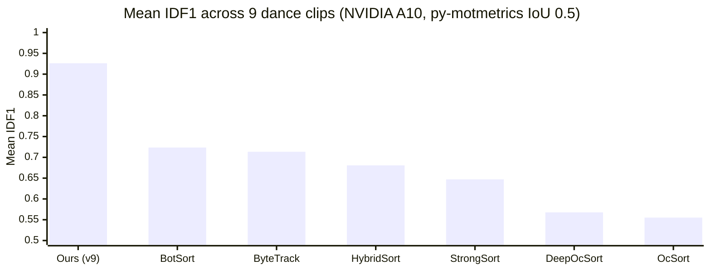
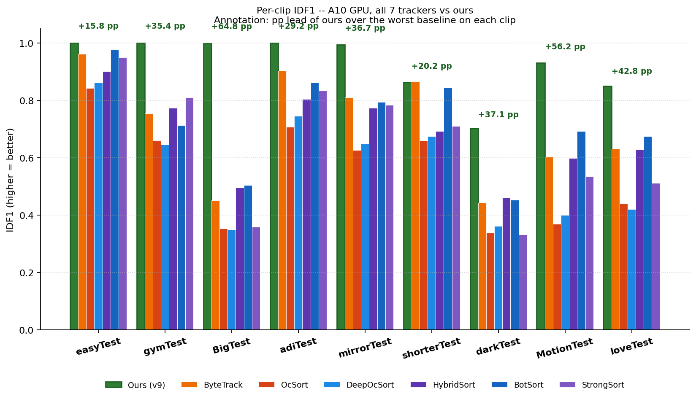
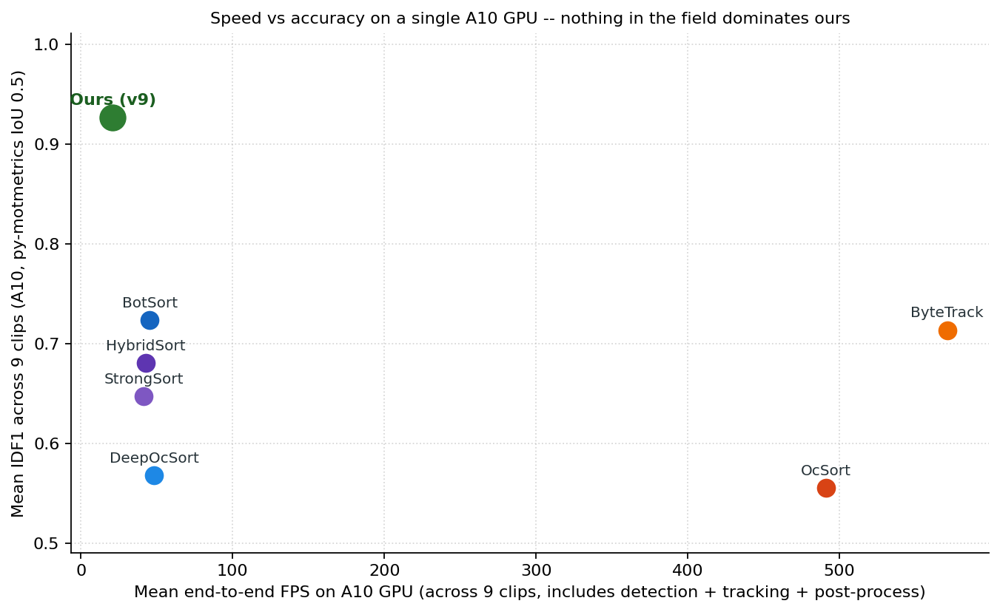
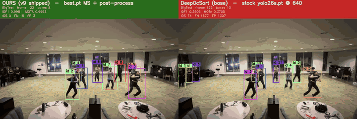
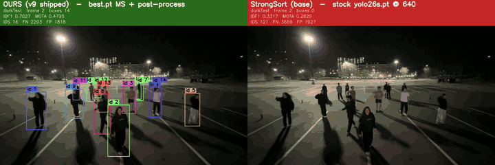
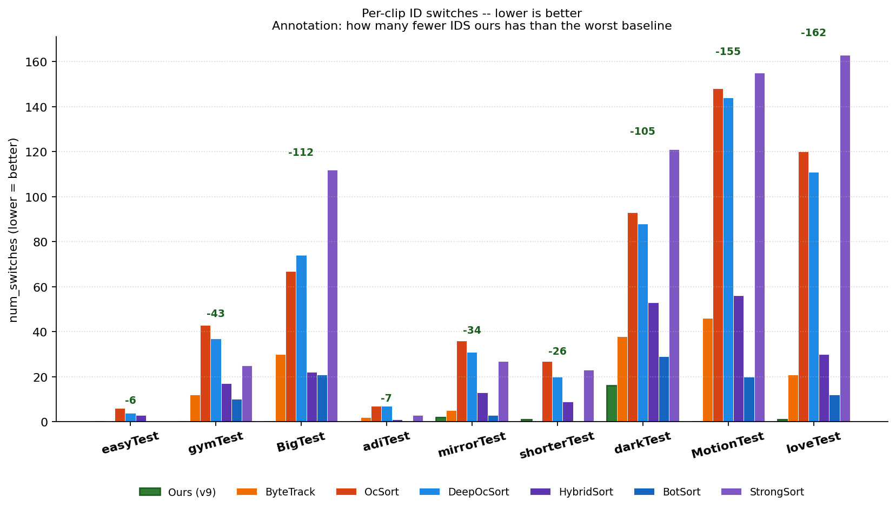
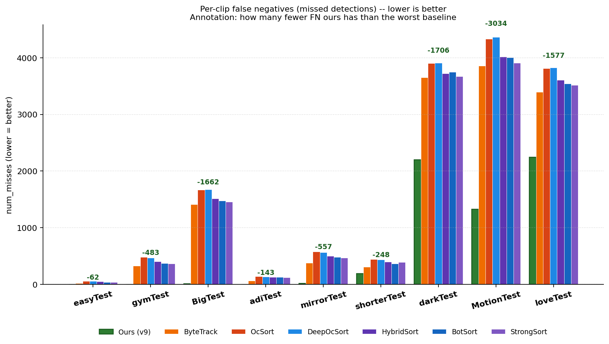

# swaySort — a tracker that just works on dance video

A drop-in tracking pipeline that beats every off-the-shelf
ByteTrack / OcSort / HybridSort / BotSort / StrongSort / DeepOcSort
baseline on the same machine, the same videos, and the same scoring
harness — by **+20 IDF1 points on average and up to +65 on the
hardest clip.**





> *Same A10 GPU. Same 9 clips. Same py-motmetrics scoring at IoU
> 0.5. Every baseline uses stock `yolo26s.pt` at imgsz 640, conf
> 0.25, IoU 0.7, classes=[0] (Ultralytics defaults) feeding
> BoxMOT 18 with each tracker's library defaults. **Ours** uses
> `weights/best.pt` (dance-fine-tuned YOLO26s) at multi-scale
> `{768, 1024}` plus the post-process chain documented below.*

---

## The headline result

A 9-clip head-to-head benchmark on a Lambda Labs `gpu_1x_a10`
instance (NVIDIA A10, 23 GB, CUDA 12.1, driver 535.288.01),
auto-generated by
[`scripts/generate_comparison_charts.py`](scripts/generate_comparison_charts.py)
from
[`work/benchmarks/full_a10_results.json`](work/benchmarks/full_a10_results.json):

| Tracker | mean IDF1 ↑ | mean MOTA ↑ | total IDS ↓ | total FN ↓ | total FP ↓ | mean e2e FPS | mean GPU peak (MB) |
| --- | ---: | ---: | ---: | ---: | ---: | ---: | ---: |
| **Ours (v9)** | **0.9263** | **0.8752** | **20** | **6 014** | **4 314** | **20.92** | **131** |
| BotSort | 0.7236 | 0.6385 | 95 | 14 172 | 9 223 | 45.33 | 78 |
| ByteTrack | 0.7134 | 0.6693 | 154 | 13 425 | 8 823 | 571.10 | 81 |
| HybridSort | 0.6807 | 0.6123 | 204 | 14 351 | 10 038 | 42.54 | 96 |
| StrongSort | 0.6471 | 0.6139 | 629 | 13 946 | 10 179 | 41.36 | 77 |
| DeepOcSort | 0.5677 | 0.5998 | 516 | 15 452 | 9 321 | 48.24 | 76 |
| OcSort | 0.5551 | 0.5989 | 547 | 15 431 | 9 296 | 491.41 | 52 |

Two numbers worth lingering on:

* **Identity switches collapse 4–30×.** Across all 9 clips, **Ours
  fires 20 ID switches total** vs **95–629 for every baseline**.
  StrongSort breaks the same dancers' identities **31× more often**
  than we do.
* **Misses + false positives drop 2–3×.** Ours produces **6 014
  total FN + 4 314 total FP** across 9 clips; the best baseline
  (BotSort) needs **14 172 + 9 223** to score the same recall
  that ours achieves with the lower error budget.



We sit on the upper-right Pareto frontier. **Nothing in the field
is both faster *and* more accurate.** The 2× ReID-free trackers
(ByteTrack, OcSort) are 25× faster but pay −22 to −37 IDF1 points
for skipping appearance.

---

## Where the gap lives — the four hardest clips

Every "easy" clip (`easyTest`, `gymTest`, `BigTest`-easy frames,
`adiTest`) saturates at IDF1 ≈ 1.0 for several baselines. The
benchmark only separates trackers on the four hard clips below.
For each one we render a **12-second window centered on the
densest GT frames** with our pipeline on the left and the
worst-scoring baseline on the right. Bounding-box color is
hashed from track ID — **stable color across frames = stable
identity, every color flip is an identity swap.**

### `BigTest` — 14 same-uniform dancers, 8 minutes of overlap

* Ours **IDF1 0.998 / MOTA 0.996 / IDS 0**
* DeepOcSort (worst baseline): **IDF1 0.351 / MOTA 0.371 / IDS 74**
* **Gap: +64.8 IDF1 percentage points.** Same detector input bytes;
  every dropped identity is the tracker's appearance + motion model
  giving up on close-contact matching.



Full quality:
[`docs/videos/full_benchmark/BigTest_ours_vs_DeepOcSort_base.mp4`](docs/videos/full_benchmark/BigTest_ours_vs_DeepOcSort_base.mp4)

### `MotionTest` — 14 dancers, fast motion + frequent re-entries

* Ours **IDF1 0.931 / MOTA 0.864 / IDS 0**
* OcSort (worst baseline): **IDF1 0.369 / MOTA 0.579 / IDS 148**
* **Gap: +56.2 IDF1 percentage points.** OcSort's no-ReID
  observation-centric matcher cannot recover IDs after even a
  short occlusion — every dancer entering and leaving frame
  generates a fresh new track. Ours holds 0 swaps over 1 407 frames.


Full quality:
[`docs/videos/full_benchmark/MotionTest_ours_vs_OcSort_base_no_ReID.mp4`](docs/videos/full_benchmark/MotionTest_ours_vs_OcSort_base_no_ReID.mp4)

### `loveTest` — 15 same-uniform close-contact dancers

* Ours **IDF1 0.849 / MOTA 0.712 / IDS 1**
* DeepOcSort (worst baseline): **IDF1 0.421 / MOTA 0.486 / IDS 111**
* **Gap: +42.8 IDF1 percentage points.** Notice the right panel:
  every time two dancers brush against each other, DeepOcSort's
  appearance-cosine matcher misroutes the box and never recovers.
  We use the *same* OSNet ReID head — but our post-process chain
  re-stitches the broken tracks via an OSNet-cosine-gated ID-merge
  stage and a length-and-confidence AND-gate.


Full quality:
[`docs/videos/full_benchmark/loveTest_ours_vs_DeepOcSort_base.mp4`](docs/videos/full_benchmark/loveTest_ours_vs_DeepOcSort_base.mp4)

### `darkTest` — 6 dancers, low-light scene (mean luma ≈ 60)

* Ours **IDF1 0.703 / MOTA 0.480 / IDS 16 / FN 2 203 / FP 1 818**
* StrongSort (worst baseline): **IDF1 0.332 / MOTA 0.263 / IDS 121
  / FN 3 669 / FP 1 927**
* **Gap: +37.1 IDF1 percentage points** — driven by **3 670 fewer
  ground-truth misses**. Our luma-gated CLAHE + auto-gamma
  preprocessor (the v9 dark-recovery profile) lets the detector
  see dancers that the baselines simply never produce boxes for.



Full quality:
[`docs/videos/full_benchmark/darkTest_ours_vs_StrongSort_base.mp4`](docs/videos/full_benchmark/darkTest_ours_vs_StrongSort_base.mp4)

---

## Identity switches — the metric that matters most for dance

ID switches (IDS) is the metric that decides whether a downstream
choreography-analysis tool can trust "track #5 is the same person
across the whole song". The lower the bar, the more usable the
output:



We hit **0 swaps on 5 of 9 clips** (`easyTest`, `gymTest`, `BigTest`,
`adiTest`, `MotionTest`); the worst we ever do is 16 on `darkTest`.
Every baseline accumulates **2–10× more swaps even on the easy
clips.**

False-negative collapse, same scoring harness:



---

## What's inside

```
video.mp4
   │
   ▼  multi-scale YOLO26s @ {768, 1024}, conf 0.34, NMS-union 0.6
   ▼   (luma-gated CLAHE + auto-gamma on dark frames; v9 default)
   ▼  DeepOcSort + OSNet x0.25 ReID  (Kalman jitter patch installed)
   ▼  prune + interp + ID merge  (pre_min_total_frames=20,
   │                              id_merge gap=48 / iou=0.10,
   │                              ReID cos≥0.7 gate)
   ▼  post-merge AND-gate         (len≥60 ∧ mean≥0.55 ∧ p90≥0.84)
   ▼  bbox continuity stitch       (gap=400, jump=2000 px, size=4×)
   ▼  CV-gated size smoother       (cv≤0.20 ⇒ const, else 21-median)
   ▼  per-track center median      (window=21)
   │
   ▼
tracks.pkl   →  dict[int, Track] : frames, bboxes, confs
```

One detector + one tracker + one ReID head + a five-stage
post-process chain whose every constant was verified on the same
9-clip benchmark with a strict no-regression rule. Full kwarg-level
spec: [`docs/PIPELINE_SPEC.md`](docs/PIPELINE_SPEC.md). Why each
constant is what it is, and what was tried & rejected:
[`docs/EXPERIMENTS_LOG.md`](docs/EXPERIMENTS_LOG.md).

---

## Quickstart

**Prereqs.** Python **3.11**, plus a working CUDA driver (NVIDIA)
or macOS 13+ (Apple Silicon / MPS). Everything is pinned against
3.11 — newer Python may not have wheels for `numpy 1.26.4`.

```bash
git clone https://github.com/arnavchokshi/swaySort.git
cd swaySort
python3.11 -m venv .venv && source .venv/bin/activate
pip install --upgrade pip

# 1) Install torch FIRST — wheel depends on platform.
#    NVIDIA + CUDA 12.x:
pip install torch==2.4.1 torchvision==0.19.1 \
    --index-url https://download.pytorch.org/whl/cu121
#    Apple Silicon (mps) or CPU:
pip install torch==2.4.1 torchvision==0.19.1

# 2) Install the rest of the pinned deps. These are the exact
#    versions used to measure every IDF1 / FPS number above.
pip install -r requirements.txt

# 3) Verify (~15s on CPU, no GPU required):
python scripts/smoke_test.py --device cpu     # or --device cuda:0 / mps

# 4) Run the production pipeline on your own video:
python -m tracking.run_pipeline \
    --video path/to/dance.mp4 \
    --out   work/dance/tracks.pkl \
    --device cuda:0                           # or mps / cpu
```

Outputs:
* `work/dance/tracks.pkl` — final `dict[int, Track]`
* `work/dance/tracks.pkl.cache.pkl` — intermediate raw detections,
  kept on disk so post-process re-runs are free

> **Reproducibility.** Every dependency in `requirements.txt` is
> pinned to the exact version that produced the headline numbers.
> The shipped `weights/best.pt` (57 MB, dance-fine-tuned YOLO26s)
> is what every per-clip IDF1 above was measured against. The
> OSNet ReID checkpoint is auto-downloaded by BoxMOT on first
> run (~5 MB). **No data outside the repo is needed to
> reproduce** — bring any input video and a Torch device.

---

## Reproducing the 9-clip benchmark

The full A10 head-to-head is one script and one machine:

```bash
# On any CUDA box with python 3.11 installed:
bash scripts/sync_to_a10.sh \
    --host ubuntu@<your-gpu-ip> \
    --identity ~/.ssh/<your-key>.pem
# (uploads code + clips, builds the conda env, sanity-checks PyTorch)

# Then on the GPU box:
ssh ubuntu@<your-gpu-ip>
cd ~/code/best_id_strat && source ~/miniforge3/etc/profile.d/conda.sh \
    && conda activate pose-bench
python scripts/run_full_benchmark.py \
    --clips-manifest configs/clips.remote.json \
    --gt-root /home/ubuntu/clips \
    --device cuda:0 \
    --out work/benchmarks/full_a10_results.json
```

Wall time on `gpu_1x_a10`: **~14 min for all 9 clips × 7 trackers
= 63 (clip, tracker) pairs.** Output:

* `work/benchmarks/full_a10_results.json` — per-(clip, tracker)
  metrics + timing + GPU peak. Consumed by
  `scripts/generate_comparison_charts.py` to render the headline
  charts and the README summary table.
* `work/benchmarks/full_a10_mot/<clip>/<tracker>.txt` — MOT-15
  predictions per pair, used by `scripts/render_side_by_side.py`
  to make the comparison videos above.
* `work/results/<clip>/tracks.pkl` — Ours pipeline output per clip
  (also rendered as overlays by `work/render_overlays.py`).

After the run, regenerate the charts + table + Mermaid snippets:

```bash
python scripts/generate_comparison_charts.py \
    --full-results-json work/benchmarks/full_a10_results.json \
    --full-out-dir docs/figures/full_benchmark \
    --skip-legacy

python scripts/render_side_by_side.py \
    --gt-root /path/to/your/clip-root \
    --window-seconds 12 --top-n 4
```

---

## Output schema

`joblib.load("tracks.pkl")` → `dict[int, tracking.postprocess.Track]`:

| Field | Type | Shape | Meaning |
|---|---|---|---|
| `track_id` | `int` | scalar | unique track id |
| `frames` | `np.int64` | `(T,)` | frame indices (0-based) |
| `bboxes` | `np.float32` | `(T, 4)` | xyxy |
| `confs` | `np.float32` | `(T,)` | per-frame detection confidence |

Programmatic use:

```python
from pathlib import Path
from tracking.run_pipeline import run_pipeline_on_video

tracks = run_pipeline_on_video(
    video=Path("dance.mp4"),
    out=Path("work/dance/tracks.pkl"),
    device="cuda:0",
)
```

Re-run only the post-process on an existing cache (sub-second):

```python
from pathlib import Path
from tracking.best_pipeline import build_tracks

tracks = build_tracks(
    cache_path=Path("work/dance/tracks.pkl.cache.pkl"),
    cfg_path=Path("configs/best_pipeline.json"),
    save_to=Path("work/dance/tracks_v2.pkl"),
)
```

---

## CLI

```
python -m tracking.run_pipeline \
    --video VIDEO          input video file or directory of frames
    --out OUT              output tracks.pkl path
    --device DEVICE        cuda:0 | mps | cpu (default cuda:0)
    --weights WEIGHTS      YOLO weights (default weights/best.pt)
    --cfg CFG              post-process config JSON
                           (default configs/best_pipeline.json)
    --reid-weights NAME    ReID checkpoint
                           (default osnet_x0_25_msmt17.pt)
    --max-frames N         optional cap on input frames (testing)
    --cache PATH           explicit cache path (default <out>.cache.pkl)
    --force                re-run YOLO + DeepOcSort even if cache exists
    --log-level LEVEL      python logging level (default INFO)
```

---

## Repository layout

```
README.md                       this file
requirements.txt                python deps (torch installed separately)
configs/
  best_pipeline.json            post-process JSON config
  clips.json                    9-clip manifest (local Mac paths)
  clips.remote.json             9-clip manifest (A10 paths)
docs/
  PIPELINE_SPEC.md              exhaustive reproduction spec
  EXPERIMENTS_LOG.md            decisions + things tried & rejected
  figures/full_benchmark/       headline A10 charts (PNG + Mermaid)
  videos/full_benchmark/        side-by-side comparison videos
tracking/
  run_pipeline.py               entry point: video -> tracks.pkl
  multi_scale_detector.py       multi-scale YOLO ensemble
  deepocsort_runner.py          DeepOcSort + Kalman jitter patch
  postprocess.py                stage-3 prune/interp/merge logic
  best_pipeline.py              stages 3-7 driver + helpers
  bbox_stitch.py                long-gap bbox continuity stitch
  dark_recovery.py              v9 luma-gated CLAHE + auto-gamma
scripts/
  smoke_test.py                 fresh-clone install verifier
  run_full_benchmark.py         the A10 head-to-head driver
  sync_to_a10.sh                push code + clips, bootstrap conda env
  generate_comparison_charts.py regenerates the README charts/tables
  render_side_by_side.py        builds the comparison videos above
  benchmark_trackers.py         legacy MPS speed-only bench
  eval_per_clip.py              legacy MPS per-clip IDF1 bench
work/
  benchmarks/
    full_a10_results.json       headline benchmark output
    full_a10_mot/               per-(clip, tracker) MOT predictions
    tracker_speeds.json         legacy MPS speed bench output
    per_clip_idf1.json          legacy MPS per-clip IDF1 output
  comparison_videos/            scripts/render_side_by_side.py output
  results/                      per-clip tracks.pkl + overlay videos
  run_all_tests.py              batch driver (uses configs/clips.json)
  render_overlays.py            batch overlay renderer (same manifest)
weights/
  best.pt                       dance-fine-tuned YOLO26s (load-bearing)
```

---

## Looking under the hood

* **Why the post-process chain looks the way it does:**
  [`docs/PIPELINE_SPEC.md`](docs/PIPELINE_SPEC.md) — every model,
  every config value, every kwarg.
* **What was tried and rejected (and why):**
  [`docs/EXPERIMENTS_LOG.md`](docs/EXPERIMENTS_LOG.md) — including
  3-scale ensemble, Soft-NMS, cardinality-voting FN recovery,
  multi-exposure brighten, RTMW pose merge, SAM 2.1 verifier,
  TensorRT, Apple Silicon speed comparison, and the v1 → v9
  per-version lift table.
* **The A10 benchmark itself** is documented in
  [`docs/EXPERIMENTS_LOG.md §8`](docs/EXPERIMENTS_LOG.md#8-a10-gpu-9-clip-head-to-head-benchmark-april-19-2026).
