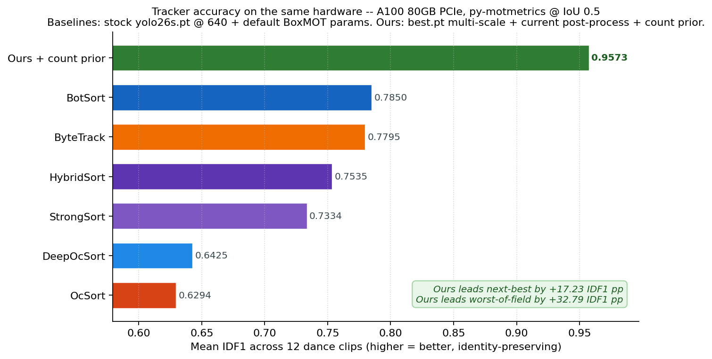
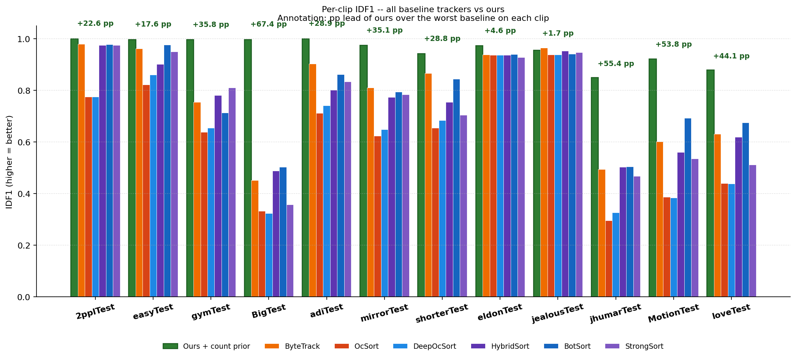
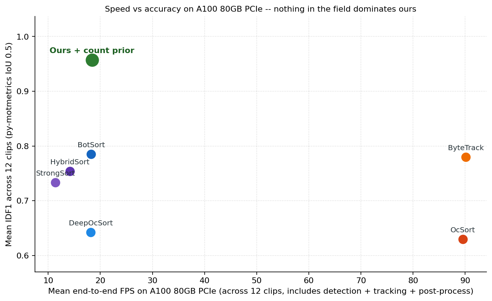
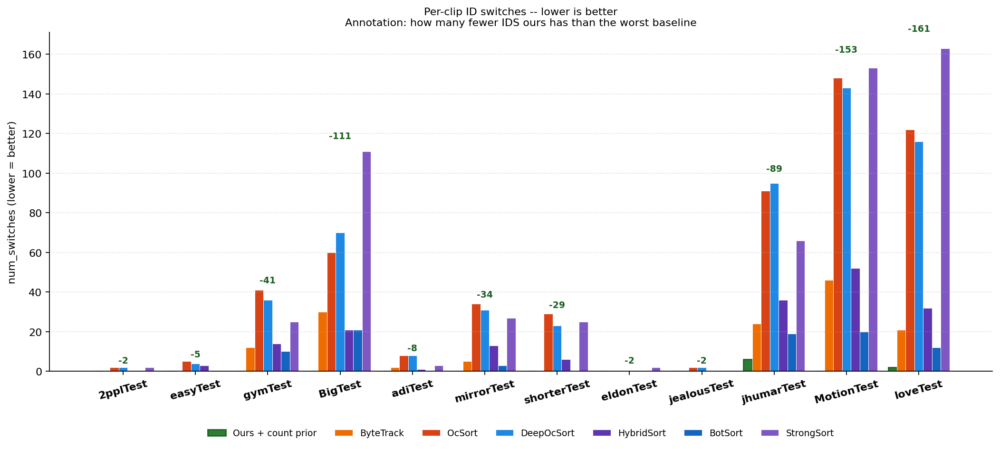
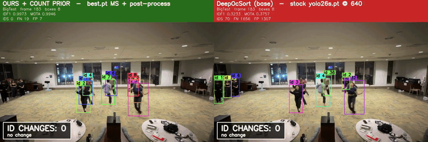
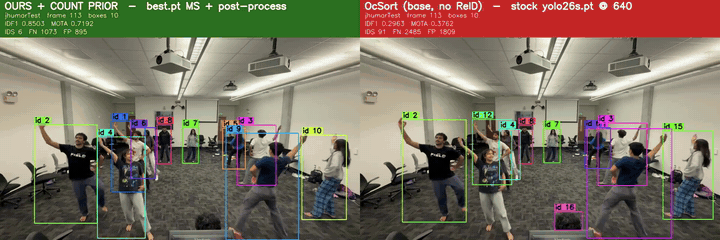
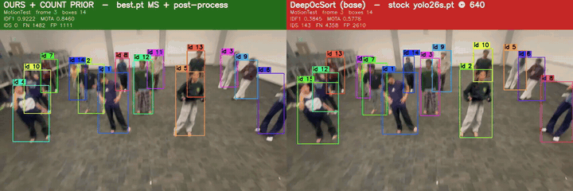

# BEST_ID_STRAT / swaySort

Standalone Stage 1 person ID + tracking for dance videos. This folder is the
reusable tracking package behind the `sam4dbody` pipeline: video in, stable
per-person `tracks.pkl` out.

The current optimized pipeline is:

```
YOLO26s dance checkpoint @ [768, 1024]
  -> BoxMOT DeepOcSort + OSNet x0.25 ReID
  -> prune / ID merge / confidence gate
  -> long-gap bbox stitch
  -> bbox smoothing + calibration
  -> optional expected-performer-count recovery
  -> tracks.pkl
```

## Accuracy vs Baselines

Fresh benchmark from May 11, 2026 across the 12 current annotated CVAT clips:
`2pplTest`, `easyTest`, `gymTest`, `BigTest`, `adiTest`, `mirrorTest`,
`shorterTest`, `eldonTest`, `jealousTest`, `jhumarTest`, `MotionTest`, and
`loveTest`.

Same benchmark harness, same clips, same NVIDIA A100 80GB GPU. Baselines use
stock `yolo26s.pt` at `imgsz=640`, `conf=0.25`, `iou=0.70`, `classes=[0]`,
feeding the default BoxMOT tracker settings. Ours uses `weights/best.pt`,
multi-scale `[768, 1024]`, DeepOcSort, the optimized postprocess chain, and the
known performer-count prior that production Stage A can receive as
`expected_total_performers`.

| Tracker | mean IDF1 ↑ | mean MOTA ↑ | total IDS ↓ | total FN ↓ | total FP ↓ | mean e2e FPS |
|---|---:|---:|---:|---:|---:|---:|
| **Ours + count prior** | **0.9573** | **0.9163** | **8** | **4,432** | **3,771** | **18.41** |
| BotSort | 0.7850 | 0.7159 | 85 | 12,835 | 9,348 | 18.25 |
| ByteTrack | 0.7795 | 0.7420 | 140 | 12,085 | 9,012 | 90.14 |
| HybridSort | 0.7535 | 0.6950 | 178 | 13,059 | 10,281 | 14.16 |
| StrongSort | 0.7334 | 0.6943 | 577 | 12,662 | 10,505 | 11.39 |
| DeepOcSort | 0.6425 | 0.6854 | 530 | 14,126 | 9,526 | 18.17 |
| OcSort | 0.6294 | 0.6850 | 542 | 14,094 | 9,498 | 89.54 |







## Identity Stability

ID switches are the failure mode that matters most for choreography and 3D
handoff: if track 5 becomes another dancer halfway through the clip, everything
downstream inherits the mistake. The current pipeline has 8 total ID switches
across all 12 current clips; the next-best baseline has 85, and the worst has
577.



## Visual Comparisons

Bounding-box color is keyed by track ID. Stable color means stable identity;
color flips mean an ID swap. Each side also has a visible `ID CHANGES` ticker
that increments when the benchmark matching detects an identity switch inside
the displayed window.

### BigTest: current pipeline vs base DeepOcSort

Current pipeline: `IDF1 0.997 / MOTA 0.995 / IDS 0`<br>
Base DeepOcSort: `IDF1 0.323 / MOTA 0.376 / IDS 70`



### jhumarTest: current pipeline vs base OcSort

Current pipeline: `IDF1 0.850 / MOTA 0.719 / IDS 6`<br>
Base OcSort: `IDF1 0.296 / MOTA 0.376 / IDS 91`



### MotionTest: current pipeline vs base DeepOcSort

Current pipeline: `IDF1 0.922 / MOTA 0.846 / IDS 0`<br>
Base DeepOcSort: `IDF1 0.385 / MOTA 0.578 / IDS 143`



## Current Stage A Mode

When `--expected-total-performers` is supplied, the current `sam4dbody` Stage A
path adds expected-count recovery and dense ID remapping. This is the mode used
for production handoff into masks and Body4D, and it is the mode benchmarked
above. On the current 12-clip CVAT set, it matches the annotated performer count
on all 12 clips.

| Metric | Current Stage A expected-count mode |
|---|---:|
| Mean IDF1 | **0.9573** |
| Mean MOTA | **0.9163** |
| Exact predicted ID count | **12 / 12 clips** |
| Total ID switches | **8** |

This is an overall benchmark win, not a claim that every clip is perfect:
`jhumarTest` and `loveTest` are still the hardest current clips, and ByteTrack
edges the current pipeline on `jealousTest` by 0.78 IDF1 percentage points.

## Pipeline Details

```
video.mp4
  -> YOLO26s dance checkpoint (`weights/best.pt`)
     imgsz=[768, 1024], conf=0.34, iou=0.70, NMS union=0.60
  -> BoxMOT DeepOcSort + OSNet x0.25 ReID
     max_age stays at BoxMOT default 30, Kalman cholesky jitter patch on
  -> postprocess_tracks
     pre-merge min_total_frames=20, min_conf=0.38,
     ID merge gap<=48, IoU>=0.10, OSNet cosine gate=0.7
  -> post-merge AND gate
     len>=60 AND mean_conf>=0.55 AND p90_conf>=0.84
  -> bbox_continuity_stitch
     max_gap=400, max_position_jump=2000 px, max_size_ratio=4.0
  -> optional edge/expected-count repairs
     detector backfill, stage-prior repair, frame-count cap are env gated;
     expected-count recovery runs when expected_total_performers is supplied
  -> size_smooth_cv_gated
     constant size if cv(w)+cv(h)<=0.20, else 21-frame median
  -> smooth_centers_median
     21-frame median on bbox centers
  -> bbox calibration
     default scale_x=0.90, scale_y=1.00, shift_x=-0.10;
     dense clips with expected_count>=12 use scale_x=0.85, scale_y=0.92
  -> tracks.pkl
```

Output schema:

| Field | Type | Meaning |
|---|---|---|
| `track_id` | `int` | Unique target identity. Expected-count mode remaps to dense `1..N`. |
| `frames` | `np.ndarray[int64]` | Zero-based frame indices. |
| `bboxes` | `np.ndarray[float32]`, shape `(T, 4)` | `xyxy` person boxes. |
| `confs` | `np.ndarray[float32]` | Per-frame detector/tracker confidence. |
| `detected` | `np.ndarray[bool]` | False means postprocess filled the sample. |

## Optional Modes

| Mode | How to enable | Notes |
|---|---|---|
| Expected performer count | `--expected-total-performers N` | Recovers or suppresses identities against the total unique dancer count and writes a presence plan when requested. |
| Presence plan | `--presence-plan path/to/presence_plan.json` | JSON summary of active target IDs, track ranges, count mismatches, and selection decisions. |
| Raw detector cache | `--detections-cache path/to/detections.pkl` | Needed by `BEST_ID_DETECTOR_BACKFILL=1`. |
| Detector edge backfill | `BEST_ID_DETECTOR_BACKFILL=1` | Extends starts/ends from unmatched detector boxes. Off by default. |
| Stage-prior repair | `BEST_ID_STAGE_PRIOR_REPAIR=1` | Trims suspicious edge entries and short inside-stage synthetic runs. Off by default. |
| Frame count cap | `BEST_ID_FRAME_COUNT_CAP=1` | Drops extra per-frame boxes above inferred or supplied count. Off by default. |
| Dark recovery profile | `BEST_ID_DARK_PROFILE=v9` | Luma-gated CLAHE + auto gamma. Off unless explicitly selected. |
| TensorRT detector | `BEST_ID_TRT_ENGINE_DIR=/path/to/engines` | Uses `<weights_stem>_<imgsz>.engine` for every ensemble scale. |

## Install

Use Python 3.11. Install Torch first with the wheel that matches your machine,
then install the pinned project requirements.

```bash
cd /Users/arnavchokshi/Desktop/CV_pipeline/BEST_ID_STRAT
python3.11 -m venv .venv
source .venv/bin/activate
pip install --upgrade pip

# NVIDIA CUDA example. Pick the index URL that matches your CUDA runtime:
pip install torch torchvision --index-url https://download.pytorch.org/whl/cu121

# Apple Silicon / CPU example:
# pip install torch torchvision

pip install -r requirements.txt
```

Weights:

- `weights/best.pt`: dance-fine-tuned YOLO26s checkpoint used by the current
  pipeline.
- `osnet_x0_25_msmt17.pt`: BoxMOT auto-downloads the ReID checkpoint on first
  use if it is not already cached. Some BoxMOT versions write it into the
  current working directory; pass `--reid-weights /abs/path/to/osnet_x0_25_msmt17.pt`
  if you want a stable explicit path.

## Run

Single video:

```bash
python -m tracking.run_pipeline \
  --video /abs/path/to/dance.mp4 \
  --out runs/my_clip/tracks.pkl \
  --device cuda:0
```

Single video with expected performer count:

```bash
python -m tracking.run_pipeline \
  --video /abs/path/to/dance.mp4 \
  --out runs/my_clip/tracks.pkl \
  --device cuda:0 \
  --expected-total-performers 14 \
  --presence-plan runs/my_clip/presence_plan.json \
  --timing-json runs/my_clip/timing.json
```

Render an ID overlay:

```bash
python scripts/render_tracks_overlay.py \
  --video /abs/path/to/dance.mp4 \
  --tracks-pkl runs/my_clip/tracks.pkl \
  --out runs/my_clip/overlay.mp4
```

Smoke test:

```bash
python scripts/smoke_test.py --device cpu
```

## Evaluate Against CVAT/MOT Ground Truth

Score existing tracks:

```bash
python scripts/eval_id_yolo_cvat.py \
  --clips adiTest \
  --tracks-root runs/id_pipeline
```

Run the current pipeline and score CVAT clips:

```bash
python scripts/eval_id_yolo_cvat.py \
  --run-pipeline \
  --device cuda:0 \
  --force \
  --save-detector-cache
```

Run the expected-count benchmark wrapper:

```bash
python scripts/benchmark_stage_a_expected_count.py \
  --run-pipeline \
  --device cuda:0 \
  --force \
  --save-detector-cache
```

## Repository Layout

| Path | Purpose |
|---|---|
| `tracking/run_pipeline.py` | Entry point: video -> `tracks.pkl`. |
| `tracking/multi_scale_detector.py` | Multi-scale YOLO ensemble plus optional dark/TensorRT modes. |
| `tracking/deepocsort_runner.py` | DeepOcSort wrapper, Kalman jitter patch, frame iterators, tracker input sanitizer. |
| `tracking/best_pipeline.py` | Production postprocess chain, bbox calibration, optional edge repairs. |
| `tracking/expected_count.py` | Expected performer count selection, split repair, dense ID remap, presence plan writer. |
| `tracking/postprocess.py` | Raw track conversion, pruning, interpolation, ID merge. |
| `tracking/bbox_stitch.py` | Long-gap bbox continuity stitching. |
| `scripts/eval_id_yolo_cvat.py` | CVAT/MOT evaluator and run harness. |
| `scripts/benchmark_stage_a_expected_count.py` | Expected-count benchmark wrapper. |
| `scripts/render_tracks_overlay.py` | Visual QA overlay renderer. |
| `tests/tracking/` | Focused unit tests for expected-count and current defaults. |
| `docs/figures/full_benchmark/` | Accuracy, speed, switch, FN/FP benchmark charts. |
| `docs/videos/full_benchmark/` | Side-by-side visual comparisons. |

## Hard Rules

- Report IDF1 with MOTA and active/count accuracy. Count accuracy alone can
  hide identity or localization failures.
- Do not raise DeepOcSort `max_age`; longer re-entry recovery belongs in
  postprocess stitching and expected-count selection.
- Do not add `1280` to the default YOLO ensemble without rerunning the full
  validation set; prior sweeps regressed `BigTest`.
- Do not tune one clip globally unless the full validation set is rescored.
