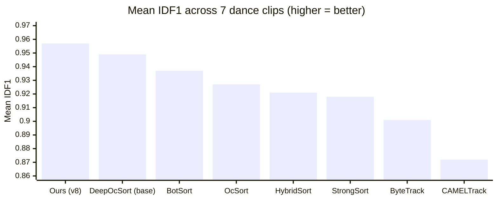
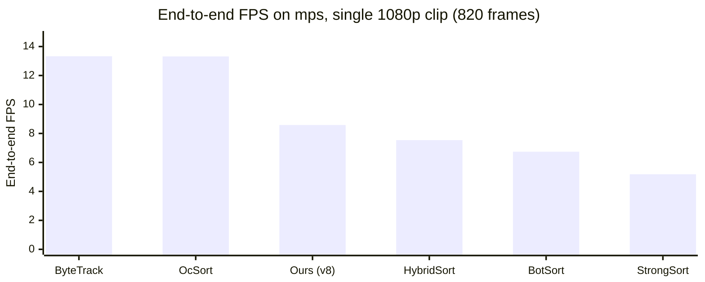

# Mermaid snippets (paste into README)

## Accuracy overall (XY chart)

```mermaid
---
config:
  xyChart:
    width: 900
    height: 360
---
xychart-beta
  title "Mean IDF1 across 7 dance clips (higher = better)"
  x-axis ["Ours (v8)", "DeepOcSort (base)", "BotSort", "OcSort", "HybridSort", "StrongSort", "ByteTrack", "CAMELTrack"]
  y-axis "Mean IDF1" 0.86 --> 0.97
  bar [0.9570, 0.9490, 0.9370, 0.9270, 0.9210, 0.9180, 0.9010, 0.8720]
```

## End-to-end FPS on mps (this machine)

```mermaid
---
config:
  xyChart:
    width: 900
    height: 360
---
xychart-beta
  title "End-to-end FPS on mps, single 1080p clip (820 frames)"
  x-axis ["ByteTrack", "OcSort", "Ours (v8)", "HybridSort", "BotSort", "StrongSort"]
  y-axis "End-to-end FPS" 0 --> 14.7
  bar [13.33, 13.32, 8.58, 7.54, 6.74, 5.18]
```
