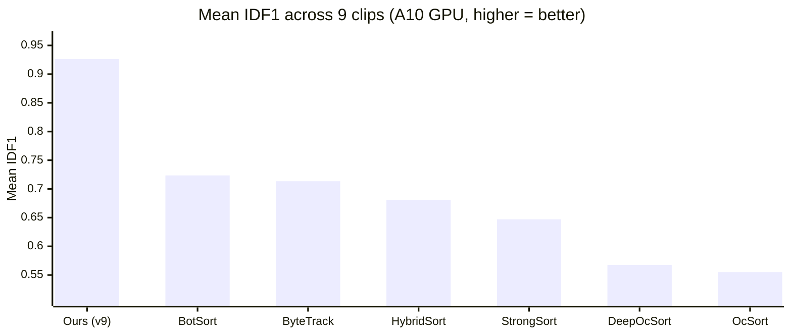
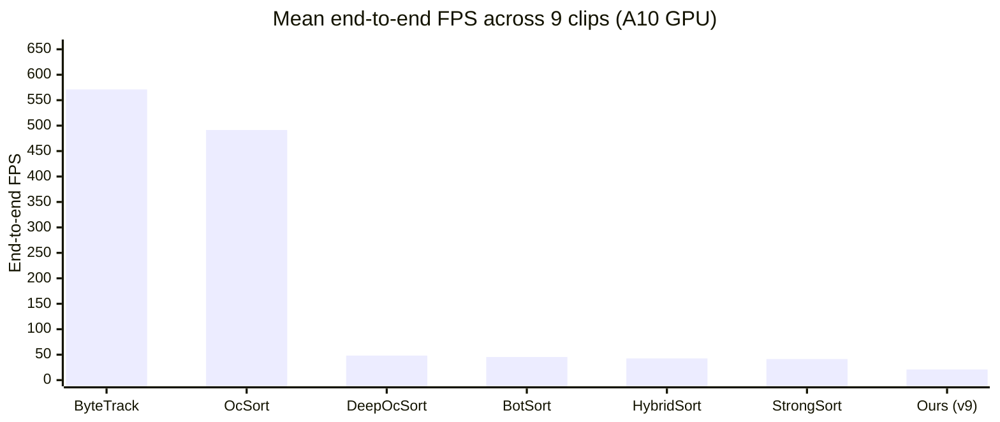

# Mermaid snippets for full A10 benchmark (paste into README)

## Mean IDF1 across 9 clips (A10 GPU)

```mermaid
---
config:
  xyChart:
    width: 950
    height: 400
---
xychart-beta
  title "Mean IDF1 across 9 clips (A10 GPU, higher = better)"
  x-axis ["Ours (v9)", "BotSort", "ByteTrack", "HybridSort", "StrongSort", "DeepOcSort", "OcSort"]
  y-axis "Mean IDF1" 0.505 --> 0.966
  bar [0.9263, 0.7236, 0.7134, 0.6807, 0.6471, 0.5677, 0.5551]
```

## Mean end-to-end FPS across 9 clips (A10 GPU)

```mermaid
---
config:
  xyChart:
    width: 950
    height: 400
---
xychart-beta
  title "Mean end-to-end FPS across 9 clips (A10 GPU)"
  x-axis ["ByteTrack", "OcSort", "DeepOcSort", "BotSort", "HybridSort", "StrongSort", "Ours (v9)"]
  y-axis "End-to-end FPS" 0 --> 656.8
  bar [571.10, 491.41, 48.24, 45.33, 42.54, 41.36, 20.92]
```
