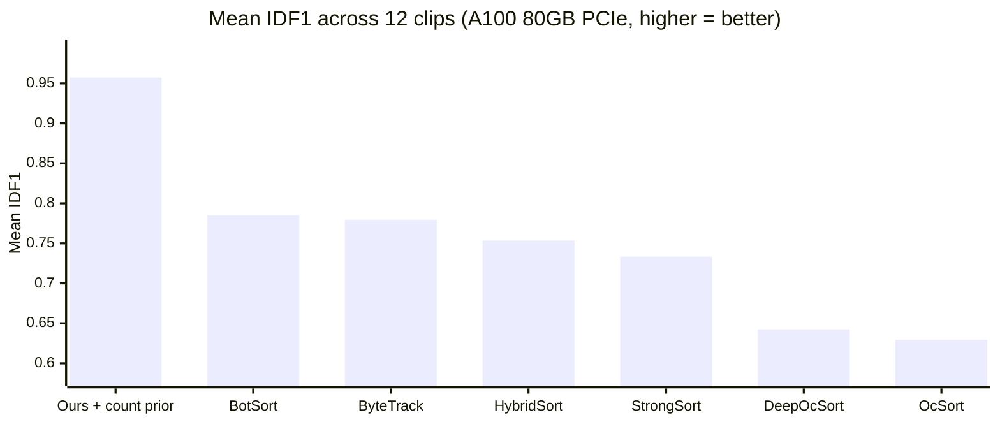
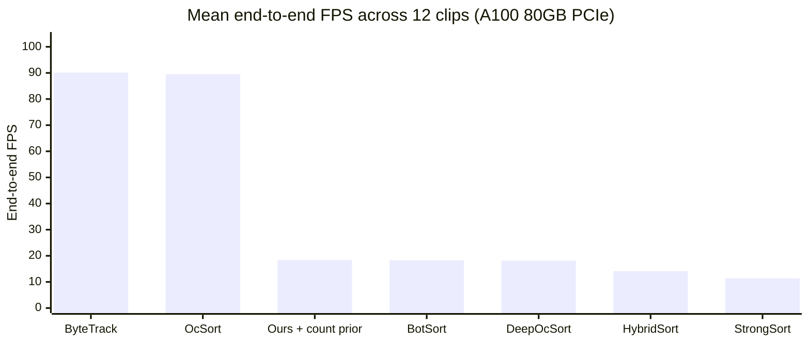

# Mermaid snippets for full GPU benchmark (paste into README)

## Mean IDF1 across 12 clips (A100 80GB PCIe)

```mermaid
---
config:
  xyChart:
    width: 950
    height: 400
---
xychart-beta
  title "Mean IDF1 across 12 clips (A100 80GB PCIe, higher = better)"
  x-axis ["Ours + count prior", "BotSort", "ByteTrack", "HybridSort", "StrongSort", "DeepOcSort", "OcSort"]
  y-axis "Mean IDF1" 0.579 --> 0.997
  bar [0.9573, 0.7850, 0.7795, 0.7535, 0.7334, 0.6425, 0.6294]
```

## Mean end-to-end FPS across 12 clips (A100 80GB PCIe)

```mermaid
---
config:
  xyChart:
    width: 950
    height: 400
---
xychart-beta
  title "Mean end-to-end FPS across 12 clips (A100 80GB PCIe)"
  x-axis ["ByteTrack", "OcSort", "Ours + count prior", "BotSort", "DeepOcSort", "HybridSort", "StrongSort"]
  y-axis "End-to-end FPS" 0 --> 103.7
  bar [90.14, 89.54, 18.41, 18.25, 18.17, 14.16, 11.39]
```
